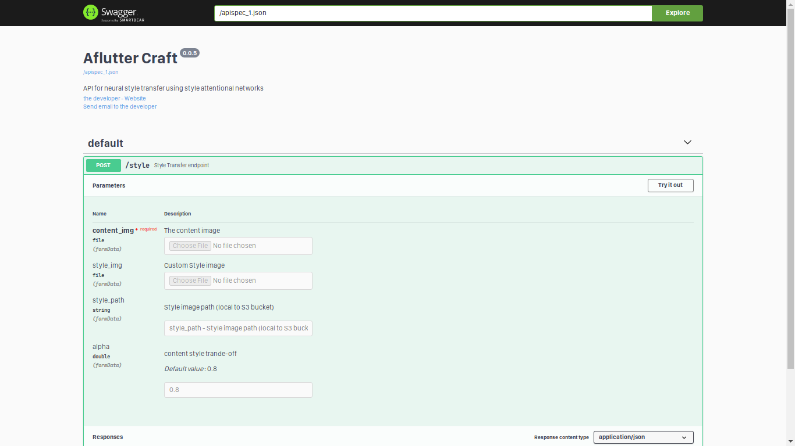

An API for style transfer build using FastAPI.

## Features

- accepts style image as URL to one of the style images in S3
- accepts style image as a base64 encoded image
- accepts style content trade-off value as alpha

## Running locally

- install requirements with `pip install -r requirements.txt`
- start API server with `uvicorn main:app --reload`
- navigate to `http://127.0.0.1:8000/docs` to test from web.

## API docs

## General Workflow

