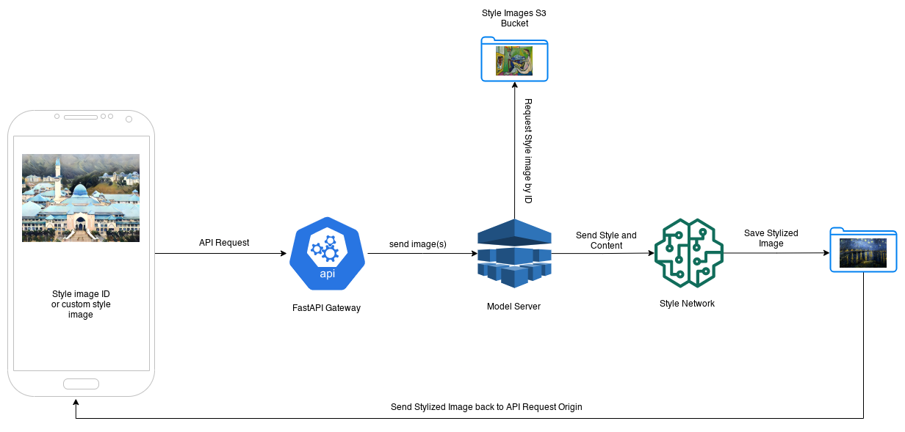

An API for style transfer build using FastAPI.

## Running locally

- install requirements with `pip install -r requirements.txt`
- start API server with `uvicorn main:app --reload`
- navigate to `http://127.0.0.1:8000/docs` to test from web.

## General Workflow

